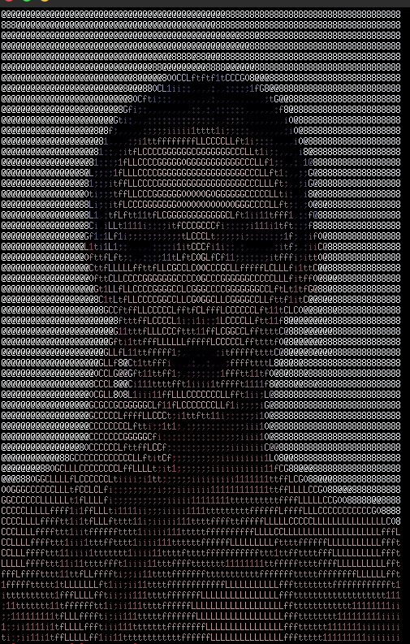

# Lion image to ascii

A C++ Program that prints a given image as ascii characters to the console or saves it to 
a file if the  `-f` option is provided; it has kind of a faulty support for animating gif images and if you can figure it out I'll love your contribution


## Example 



## Usage

> You must have the Imagemagick program and Magick++ library to compile this program 

```sh

make

```

then run

```sh

make install && make clean

```

After compiling just run ->

```sh

image-to-ascii imagePath [-r widthxheight] [-a asciichars] [-f filename]

```

## Tools

 [ImageMagick®](https://imagemagick.org/) 


## Author

**Kosiken**


### Todo

- Fix window size option [ <span style="color: red">x</span> ]
- Add option for scale [ <span style="color: red">x</span> ]
- Fix issues for gif resize [ <span style="color: red">x</span> ]
